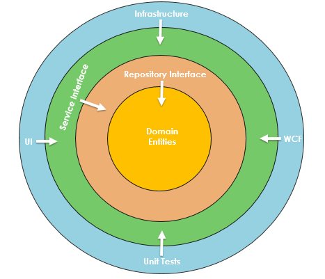

Table of Contents
- [Introduction](#introduction)
- [General instructions](#general-instructions)
- [API documents](#api-documents)
- [Database](#database)
- [Design](#design)
  - [Architecture](#architecture)
  - [Rating calculation](#rating-calculation)

## Introduction
This is a simple Spring Boot application that provides RESTful APIs for managing 
movies and movie ratings. The application uses H2 database to store the data.

The application provides the following APIs:
- `GET  /movies`: Get a list of movies, support pagination and search by title.
- `POST /movies/{movieId}/ratings`: Add a rating to a movie. Rating is from 1 to 10.

## General instructions
1. Start the application
```shell
./gradlew bootRun
```

2. Run all the tests
```shell
./gradlew test
```

3. Build the project
```shell
./gradlew build
```

4. Generate flyway migartion file
```shell
./gradlew flywayGenerate
```

5. Run the flyway migration
```shell
./gradlew flywayMigrate
```

6. Clean the flyway migration
```shell
./gradlew flywayClean
```

## API documents
When the application is running locally, you can access the API documents via 
the following URL:
```
http://localhost:8080/swagger-ui/index.html
```

## Database
The application uses H2 database. You can access the H2 console via the following URL:
```
http://localhost:8080/h2-console
```
You can refer to the `application-dev.yml` file for the database connection information.

## Design
### Architecture
The application is designed according to the DDD principle and the onion 
architecture with the following layers:

- **Domain Model**: The core business logic of the application.
- **Domain Service**: The service layer to handle business logic between domain 
  models, it also includes the repository interfaces.
- **Application Service**: The service layer to orchestrate the domain services 
  and provide the use cases to the controller.
- **User Interface & Infrastructure**: The outermost layer that interacts with 
  the external systems, including the controller, repository implementation, 
  and external services integration.

As you can see from the following diagram, the dependencies between the layers 
are unidirectional, which ensures the core business logic is aggregated in the 
domain model and domain service layers. _The code of this project is organized 
adhering to this architecture._



See the following references for more details:
- [Understanding Onion Architecture](https://www.codeguru.com/csharp/understanding-onion-architecture/)
- [Onion Architecture](https://medium.com/expedia-group-tech/onion-architecture-deed8a554423)
- [DDD](https://en.wikipedia.org/wiki/Domain-driven_design)

### Rating calculation
The average rating of a movie is calculated when a new rating is added. 
The result is stored in the `average_rating` column of the `movies` table.

- The considerations for this design are:
  - The average rating is calculated when a new rating is added to avoid 
    recalculating the average rating every time the movie list is queried. 
    This approach improves the application's performance.
  - Querying the movie list is much more frequent than adding ratings. Users are 
    less interested in real-time updates of the average rating.
  - After a large number of ratings exist, the average rating becomes more 
    stable, and one user's rating will not significantly affect it. Users do not 
    require real-time updates of the average rating. We can easily refine this API 
    to asynchronously calculate the rating to get a better performance.

